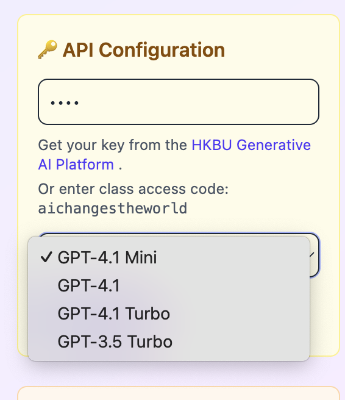

a few feedback

let's deal with one issue at a time

✅ avatar option should be removed as we focus on text-based chatbot

✅ no need to have token usage section

just context window would be fine

we should make non-openAI model as main options

still seeing the old models - no default model anymore

after connect, welcome prompt should be shown

Or enter class access code: aichangestheworld this should be removed and the code won't work

teachers will tell students about the secret code
